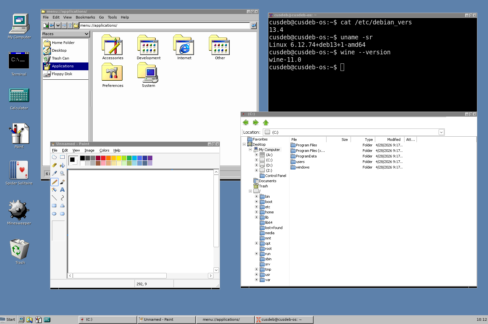

# C:\Deb

C:\Deb is a **Win32/Linux** system built on **Debian 13** and **Wine**, with a borrowed userland from **ReactOS**, focused on seamless support for Windows applications without giving up traditional Linux software.



## Table of Contents

- [Run C:\Deb](#run-cdeb)
  - [Run in QEMU (recommended)](#run-in-qemu-recommended)
  - [1. Download image](#1-download-image)
  - [2. Extract image](#2-extract-image)
  - [3. Run VM](#3-run-vm)
  - [Run in VirtualBox](#run-in-virtualbox)
- [Build from source (optional)](#build-from-source-optional)
- [Project details](#project-details)
- [Donate](#donate)

## Run C:\Deb

Prebuilt images are available on [GitHub Releases](https://github.com/cusdeb-com/os/releases).

There are two formats:

* **Raw image (`.img`)** — for QEMU
* **VDI disk (`.vdi`)** — for VirtualBox

## Run in QEMU (recommended)

### 1. Download image

From the latest release, download:

* `cusdeb-os.img.7z`

### 2. Extract image

```bash
7z x cusdeb-os.img.7z
```

### 3. Run VM

```bash
qemu-system-x86_64 \
  -enable-kvm \
  -m 4096 \
  -smp 2 \
  -drive file=cusdeb-os.img,format=raw,if=virtio \
  -device virtio-vga \
  -device qemu-xhci \
  -device usb-kbd \
  -device usb-tablet \
  -serial stdio \
  -monitor none \
  -display gtk
```

## Run in VirtualBox

Here's a [full step-by-step guide](docs/virtualbox.md) with screenshots.

## Build from source (optional)

If you want to build the image yourself:

```bash
sudo apt update
sudo apt install -y docker.io
```

```bash
IMAGE_NAME=cusdeb-os.img ROOT_PASSWORD=root ./run-docker-build.sh
```

## Project details

* Debian `trixie`
* `amd64`
* GRUB (BIOS/MBR)
* Lightweight GUI + Wine Explorer
* Reproducible Docker-based build

## Donate

The best way to support the project is by subscribing to the tech magazine [CDMAG](https://cusdeb.com/cdmag).

There you can learn how modern operating systems work in practice and stay up to date with the open source ecosystem.
