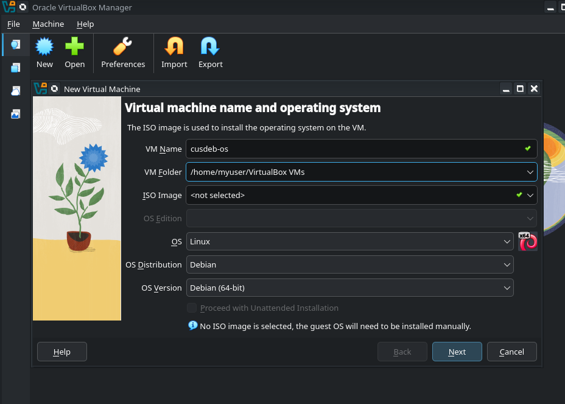
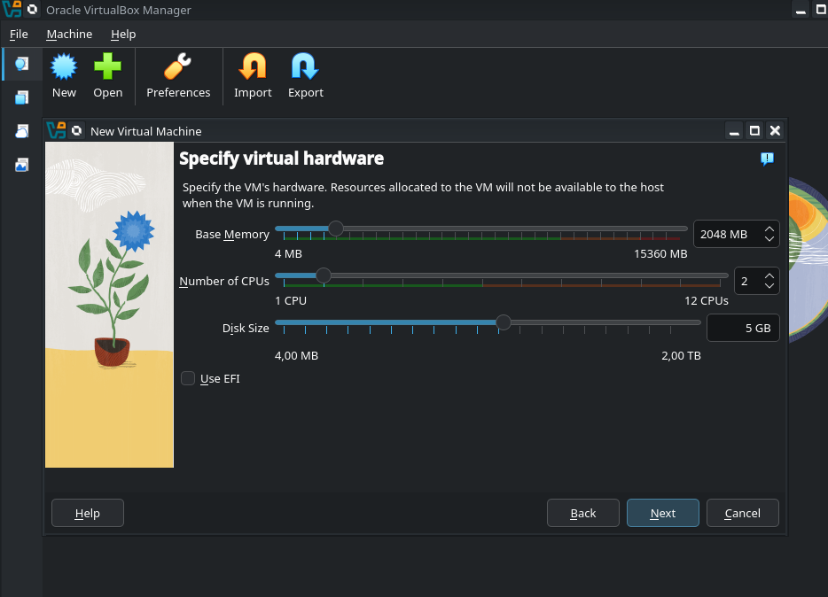
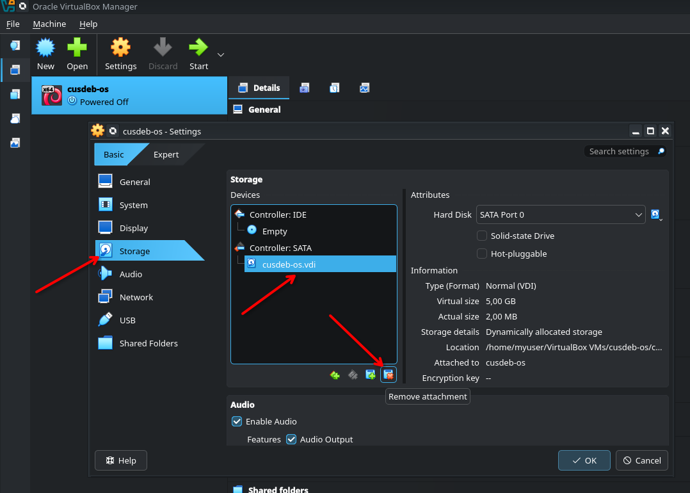
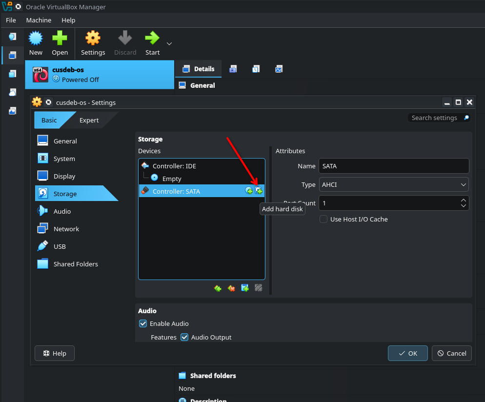
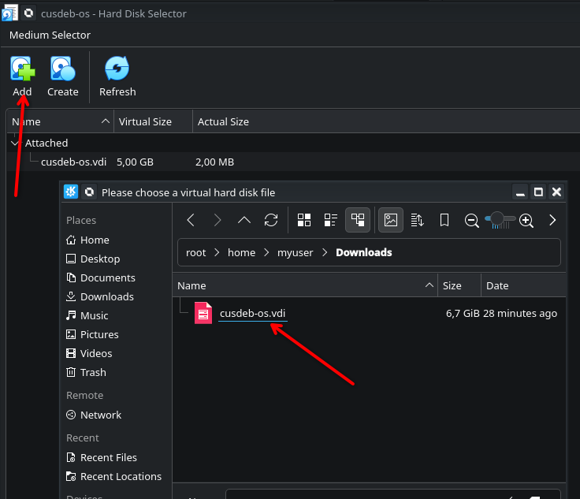
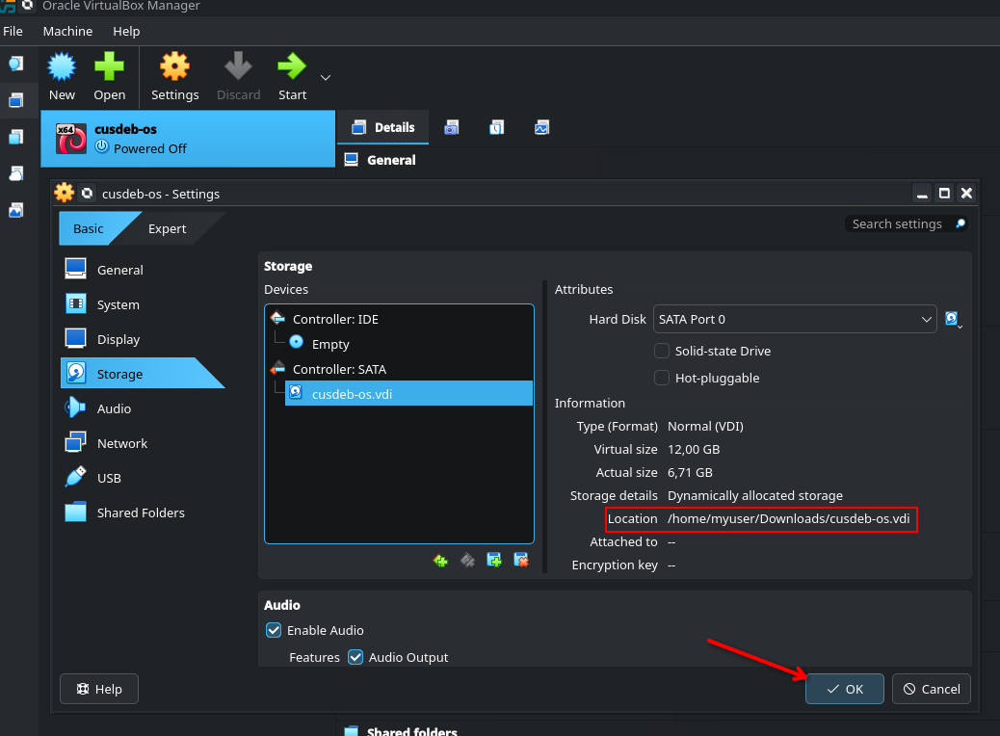

## Run in VirtualBox

Use this path if you want to boot the published image in VirtualBox instead of building and running it through QEMU yourself.

### 1. Download the required files from Releases

From the release you want to use, download:

- `cusdeb-os.vdi.7z`

The `VDI` archive is the VirtualBox-ready disk image. You do not need to convert anything manually.

### 2. Extract the VDI image

Extract the archive with:

```bash
7z x cusdeb-os.vdi.7z
```

After extraction, you should have a file named:

```text
cusdeb-os.vdi
```

At this point, open VirtualBox and continue with the VM creation and disk attachment steps.

### 3. Create a new virtual machine

In the main VirtualBox window, click **New** and enter a name for the virtual machine, for example `cusdeb-os`.
Set the operating system type to **Linux** and the version to **Debian (64-bit)**.



### 4. Go through the virtual hardware step

On the **Specify virtual hardware** step, you can leave the memory size, CPU count, and disk size at their default values.
The only important setting here is: **make sure `Use EFI` is disabled**.



### 5. Open the storage settings of the new VM

After the virtual machine has been created, open **Settings → Storage**.
Select the automatically created virtual disk and remove it from the VM configuration.

If VirtualBox asks whether you want to delete the disk file, **do not delete the file**. You only need to detach it from the VM.



### 6. Add an existing hard disk

In the same **Storage** section, click **Add Hard Disk**.
This is how you attach the prebuilt `VDI` file downloaded from the release.



### 7. Select the downloaded VDI

In the dialog that opens, click **Add**, then choose the extracted `cusdeb-os.vdi` file that you downloaded from the release.
After that, select it from the list and confirm the selection.



### 8. Verify the disk path and save the settings

Make sure the correct `cusdeb-os.vdi` file is now attached in **Storage**.
If the path is correct, click **OK**.



The virtual machine is now ready. You can start it from the main VirtualBox window.
